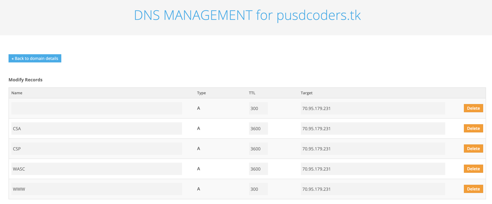
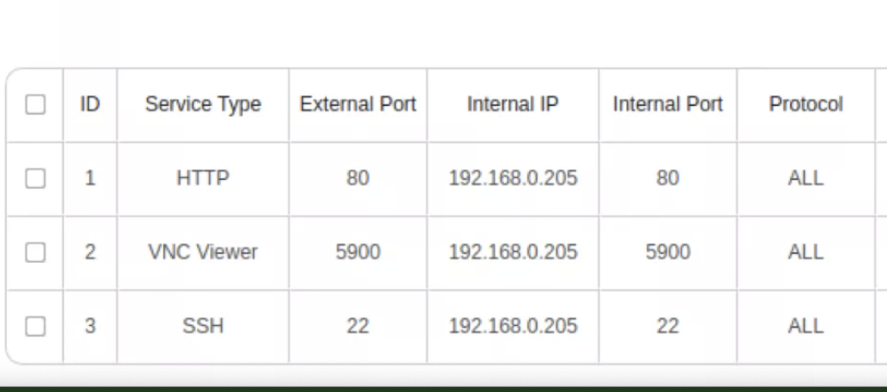

# Deployment Guide

## Setup Virtual environment and clone code from GitHub
#### In console/terminal (first time only: setup environment)...

pi@raspberrypi:~ $  ``` sudo apt update; sudo apt upgrade```

pi@raspberrypi:~ $  ``` sudo apt install python3-pip nginx```

pi@raspberrypi:~ $  ``` sudo pip3 install virtualenv```

pi@raspberrypi:~ $  ``` cd ~```

```diff
- This clone and cd name MUST change to matcch your repository
+ REPLACE flask-idea-homesite with your repo name
```

pi@raspberrypi:~ $  ```git clone https://github.com/nighthawkcoders/flask-idea-homesite```

pi@raspberrypi:~ $  ```cd ~/flask-idea-homesite```

#### Activate virual environment prior to updating packages...
```diff
- The homesite name should be a name that corresponds with project for easy recall 
+ REPLACE homesite with your virtualenv preferred name
```

pi@raspberrypi:~/flask-idea-homesite $  ```virtualenv -p /usr/bin/python3 homesite```

#### pip install and/or requirements.txt (if you have one) to satisfy dependencies...

(homesite) pi@raspberrypi:~/flask-idea-homesite $ ```  pip install gunicorn```

(homesite) pi@raspberrypi:~/flask-idea-homesite $ ```  pip install -r requirements.txt```

#### Verify Python virual environment and package dependencies, if it fails pip install dependency
```diff
- The main.py name should be a name that corresponds with the file you typically run in development environment, it should contain app 
+ REPLACE main.py with your <my-python-file>.py
```

(homesite) pi@raspberrypi:~/flask-idea-homesite $ ``` python main.py ``` 

#### Test Python run in browser ...

http://localhost:8080/ 

stop test server by typing control-c in terminal

(homesite) pi@raspberrypi:~/flask-idea-homesite $ ``` ^c ``` 

#### Verify Gunicorn instalation, In console/terminal test Gunicorn test Server...
#### Verify Python virual environment and package dependencies. If it fails pip install each missing dependency, best to get these into requirements.txt
```diff
- The main:app with file that contain Flask app 
+ REPLACE main:app with your <my-python-file>:app
```

(homesite) pi@raspberrypi:~/flask-idea-homesite $ ```homesite/bin/gunicorn --bind 0.0.0.0:8080 main:app```

in your browser ...

#### Test Gunicorn run in browser ...

http://localhost:8080/ 

(homesite) pi@raspberrypi:~/flask-idea-homesite $ ``` ^c ``` 


#### Virual environment is ready, this is how you get out of virualenv and return to home directory...

(homesite) pi@raspberrypi:~/flask-idea-homesite $ ``` deactivate```

pi@raspberrypi:~/flask-idea-homesite $  ``` cd```

## Creating System Files to run your Web Application as a Service

### Build Gunicorn configuration file.

#### In console/terminal with nano, vi, or other text editor (first time only: setup Gunicorn configuration file)...
```diff
- The homesite filename and name reference, the main:app should change as discussed previously
+ REPLACE according to your project requirements
```

pi@raspberrypi:~ $  ``` sudo nano /etc/systemd/system/homesite.service```

    [Unit]
    Description=Gunicorn instance to serve homesite web project
    After=network.target

    [Service]
    User=pi
    Group=www-data
    WorkingDirectory=/home/pi/flask-idea-homesite
    Environment="PATH=/home/pi/flask-idea-homesite/homesite/bin"
    ExecStart=/home/pi/flask-idea-homesite/homesite/bin/gunicorn --workers 3 --bind unix:homesite.sock -m 007 main:app

    [Install]
    WantedBy=multi-user.target

### Build Nginx configuration file.

```diff
- THESE server_name values MUST CHANGE to match your solution:  
- nighthawkcoders.cf 70.95.179.231
+ REPLACE with yourdomain.com yourpublic-ip
```
#### In console/terminal with nano, vi, or other text editor (first time only: setup Nginx configuration file)...

pi@raspberrypi:~ $  ``` sudo nano /etc/nginx/sites-available/homesite```

    server {
        listen 80;
        server_name nighthawkcoders.cf 70.95.179.231;

        location / {
            include proxy_params;
            proxy_pass http://unix:/home/pi/flask-idea-homesite/homesite.sock;
        }
    }


## Validate Gunicorn configuration file and enable service permanently
#### In console/terminal start Gunicorn

```diff
- This service file name MUST CHANGE to match your name of your gunicorn service 
+ REPLACE with <filename>.service
```

pi@raspberrypi:~ $ ```sudo systemctl start homesite.service```

pi@raspberrypi:~ $ ```sudo systemctl enable homesite.service```
 
check the status, if all OK enable service permanentley...

pi@raspberrypi:~ $ ```sudo systemctl status homesite.service```

stop status by typing q in terminal


## Validate Nginx configuration file and enable service permanently
#### In console/terminal start Nginx

link file...

pi@raspberrypi:~ $ ```sudo ln -s /etc/nginx/sites-available/homesite /etc/nginx/sites-enabled```

test for errors...

pi@raspberrypi:~ $ ```sudo nginx -t```

start the web server...

pi@raspberrypi:~ $ ```sudo systemctl restart nginx```

check nginx status...

pi@raspberrypi:~ $ ```sudo systemctl status nginx```

stop status by typing q in terminal

in address bar of browser on another device in LAN type IP address of this Nginx server ...

```diff
- This IP address MUST CHANGE to match your Raspberry Pi 
+ REPLACE with yourpi-ip
```
http://192.168.1.245/

## Goto freenom.com and register public IP Address to a Domain

```diff
- Domain and Public IP Address match your nginx configuration files 
+ REPLACE freenom config with your-domain and your-public-ip, make one or more a records for each project
```



## Port Forward your Web application on Internal Host (aka RPi) to the Internet
```diff
- Your Public IP Address needs to connect to your host on Private IP network through Port Forwarding 
+ PROCESS will vary on every home network, but basic premis is to Port forward external port 80 to your Private Host (aka RPi) on internal port 80
```


